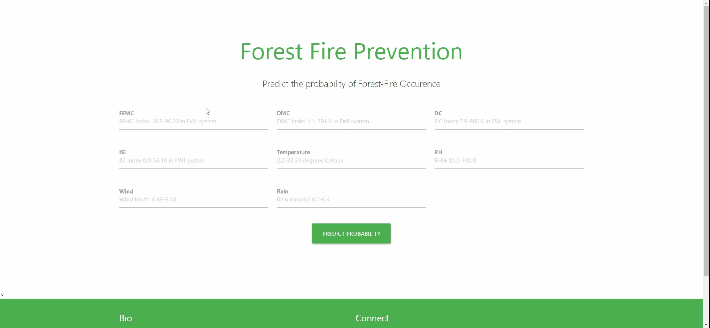

## Forest-Fire-Prediction
The goal is to predict if there will be a forest fire ML/DL techniques.

#### Description of the Application:
[Forest Fire Prediction App](https://forest-valley-fire-prediction.herokuapp.com/) is a Machine Learning Based App,currently on a MLP Classifier Model,with a accuracy of 53%.The Frontend has been built using Html,CSS,Bootstrap,MaterialUI and backend is running on a Flask Server.

#### Scope of Improvement:
Currently working on imporving the model,to increase the accuracy of model.

#### Application Link:
App Link:  https://forest-valley-fire-prediction.herokuapp.com/

#### Demo:

